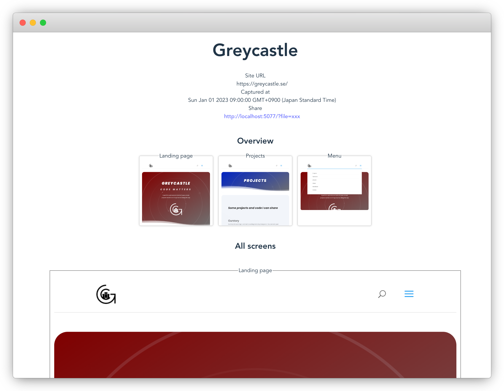

# Site Explorer

An app that takes a json file and presents the images in a easily scrollable way.

The idea of this is to be able to easily be able to look through the contents of a large side without having to navigate through all of it by having an automated tool such as Playwright capture the screenshots.



## Run

```shell
npm run dev
```